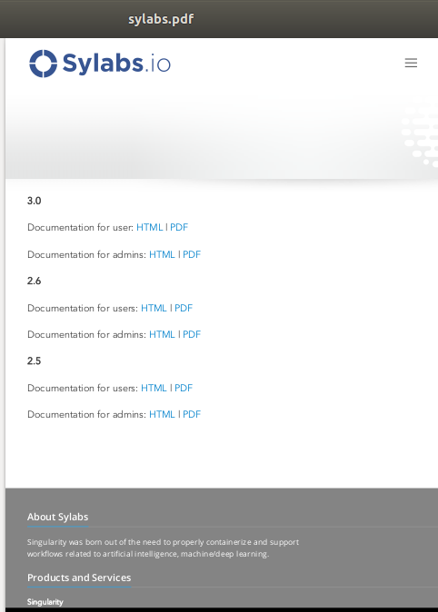

# URL-to-PDF API

This is an example that demonstrates packaging a service into a container and running it. The service we will be packaging is an API server that converts a web page into a PDF, i.e., it can convert any URL or HTML content to a PDF file or an image (PNG/JPEG) and can be found [here](https://github.com/alvarcarto/url-to-pdf-api). This service is useful when you need to automatically produce PDF files for receipts, weekly reports, invoices, or any other type of content.

Follow the steps below to build the Singularity image required for running this service or you can just download the final image directly from [Container Library](https://cloud.sylabs.io/library/_container/5c3e3b66b0877b0001b0b3fc#container-5c3e3b66b0877b0001b0b3fd), simply run
`$ singularity pull library://sylabs/doc-examples/url-to-pdf:latest`.


### Building the image 

This section will describe the requirements for creating the definition file ([url-to-pdf.def](https://github.com/sylabs/examples/blob/master/file-generating/URL-to-PDF%20api/url-to-pdf.def)) that will be used to build the container image. `url-to-pdf-api` is based on a Node 8 server that uses a headless version of Chromium called [Puppeteer](https://github.com/GoogleChrome/puppeteer). Let’s first choose a base from which to build our container, in this case the Docker image `node:8` which comes pre-installed with Node 8 has been used:

```
Bootstrap: docker
From: node:8
Includecmd: no
```
Puppeteer also requires a few dependencies to be manually installed in addition to Node 8, so we can add those into the `post` section as well as the installation script for `url-to-pdf`:
```
%post

    apt-get -y update && apt-get install -yq gconf-service libasound2 \
        libatk1.0-0 libc6 libcairo2 libcups2 libdbus-1-3 libexpat1 \
        libfontconfig1 libgcc1 libgconf-2-4 libgdk-pixbuf2.0-0 \
        libglib2.0-0 libgtk-3-0 libnspr4 libpango-1.0-0 \
        libpangocairo-1.0-0 libstdc++6 libx11-6 libx11-xcb1 libxcb1 \
        libxcomposite1 libxcursor1 libxdamage1 libxext6 libxfixes3 libxi6 \
        libxrandr2 libxrender1 libxss1 libxtst6 ca-certificates \
        fonts-liberation libappindicator1 libnss3 lsb-release xdg-utils \
        wget curl && rm -r /var/lib/apt/lists/*
    git clone https://github.com/alvarcarto/url-to-pdf-api.git pdf_server
    cd pdf_server
    npm install
    chmod -R 0755 .
```
And now we need to define what happens when we start an instance of the container. In this situation, we want to run the commands that starts up the url-to-pdf server:
```
%startscript
    cd /pdf_server
    # Use nohup and /dev/null to completely detach server process from terminal
    nohup npm start > /dev/null 2>&1 < /dev/null &
```

Also, the `url-to-pdf` server requires some environment variables to be set, which we can do in the environment section:
```
%environment
    NODE_ENV=development
    PORT=9000
    ALLOW_HTTP=true
    URL=localhost
    export NODE_ENV PORT ALLOW_HTTP URL
```
Now that the definition file is complete, the SIF file can be created by issuing the following `build` command:
```
$ sudo singularity build url-to-pdf.sif url-to-pdf.def
```
### Running the Service 

We can now start an instance and run the service:

```
$ sudo singularity instance start url-to-pdf.sif pdf
```
**Note:**
If there occurs an error related to port connection being refused while starting the instance, 
or while using it later, you can try specifying different port numbers in the definition file above.


We can confirm it’s working by sending the server an http request using curl:

```
$ curl -o sylabs.pdf localhost:9000/api/render?url=http://sylabs.io/docs

% Total    % Received % Xferd  Average Speed   Time    Time     Time  Current
                         Dload  Upload   Total   Spent    Left  Speed

100 73750  100 73750    0     0  14583      0  0:00:05  0:00:05 --:--:-- 19130
```

You should see a PDF file being generated like the one shown below:



If you shell into the instance, you can see the running processes:

```
$ sudo singularity shell instance://pdf

Singularity url-pdf.sif:~> ps auxf
USER       PID %CPU %MEM    VSZ   RSS TTY      STAT START   TIME COMMAND
root       461  0.0  0.0  18204  3188 pts/1    S    17:58   0:00 /bin/bash --norc
root       468  0.0  0.0  36640  2880 pts/1    R+   17:59   0:00  \_ ps auxf
root         1  0.0  0.1 565392 12144 ?        Sl   15:10   0:00 sinit
root        16  0.0  0.4 1113904 39492 ?       Sl   15:10   0:00 npm
root        26  0.0  0.0   4296   752 ?        S    15:10   0:00  \_ sh -c nodemon --watch ./src -e js src/index.js
root        27  0.0  0.5 1179476 40312 ?       Sl   15:10   0:00      \_ node /pdf_server/node_modules/.bin/nodemon --watch ./src -e js src/index.js
root        39  0.0  0.7 936444 61220 ?        Sl   15:10   0:02          \_ /usr/local/bin/node src/index.js

Singularity url-pdf.sif:~>> exit
```
### Enhancing the Definition File

Now that we have confirmation that the server is working, let’s make it a little cleaner. It’s difficult to remember the exact `curl` command and URL syntax each time you want to request a PDF, so this section will demonstrate enhancing of definition file to automate it. To do that, we can use Standard Container Integration Format (SCIF) apps, that are integrated directly into singularity. If you haven’t already, check out the [Scientific Filesystem documentation](https://sci-f.github.io/) to come up to speed.

First off, we’re going to move the installation of the url-to-pdf into an app, so that there is a designated spot to place output files. To do that, we want to add a section to our definition file to build the server:
```
%appinstall pdf_server
    git clone https://github.com/alvarcarto/url-to-pdf-api.git pdf_server
    cd pdf_server
    npm install
    chmod -R 0755 .
```
And update our `startscript` to point to the app location:

```
%startscript
    cd "${APPROOT_pdf_server}/pdf_server"
    # Use nohup and /dev/null to completely detach server process from terminal
    nohup npm start > /dev/null 2>&1 < /dev/null &
```

Now we want to define the pdf_client app, which we will run to send the requests to the server:
```
%apprun pdf_client
    if [ -z "${1:-}" ]; then
        echo "Usage: singularity run --app pdf <instance://name> <URL> [output file]"
        exit 1

    fi
    curl -o "${SINGULARITY_APPDATA}/output/${2:-output.pdf}" "${URL}:${PORT}/api/render?url=${1}"
```

As you can see, the `pdf_client` app checks to make sure that the user provides at least one argument. Find the full def file [here](https://github.com/sushma-98/examples/blob/master/file-generating/URL-to-PDF%20api/url-to-pdf-edited.def).

Create the container as before. The `--force` option will overwrite the old container:
```
$ sudo singularity build --force url-to-pdf.sif url-to-pdf-edited.def
```
Now that we have an output directory in the container, we need to expose it to the host using a bind mount. Once we’ve rebuilt the container, make a new directory called `out` in you Home directory for the generated PDFs to go.
```
$ mkdir out
```
After building the image from the edited definition file we simply start the instance:
```
$ singularity instance start --bind out/:/output url-to-pdf.sif pdf
```
To request a pdf simply do:
```
$ singularity run --app pdf_client instance://pdf http://sylabs.io/docs sylabs.pdf
```
To confirm that it worked:
```
$ ls out
sylabs.pdf
```
When you are finished, use the instance stop command to close the running instance.

```
$ singularity instance stop pdf
```
