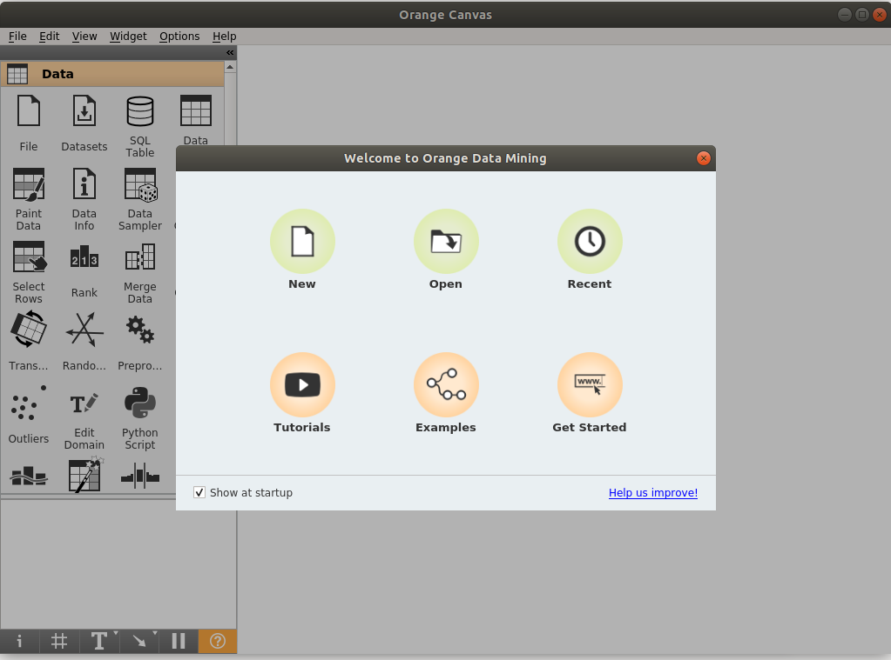
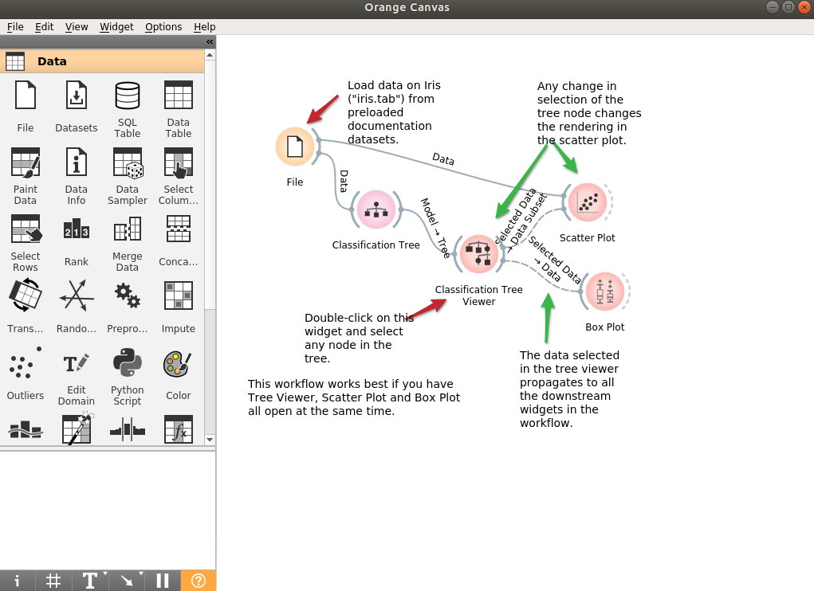
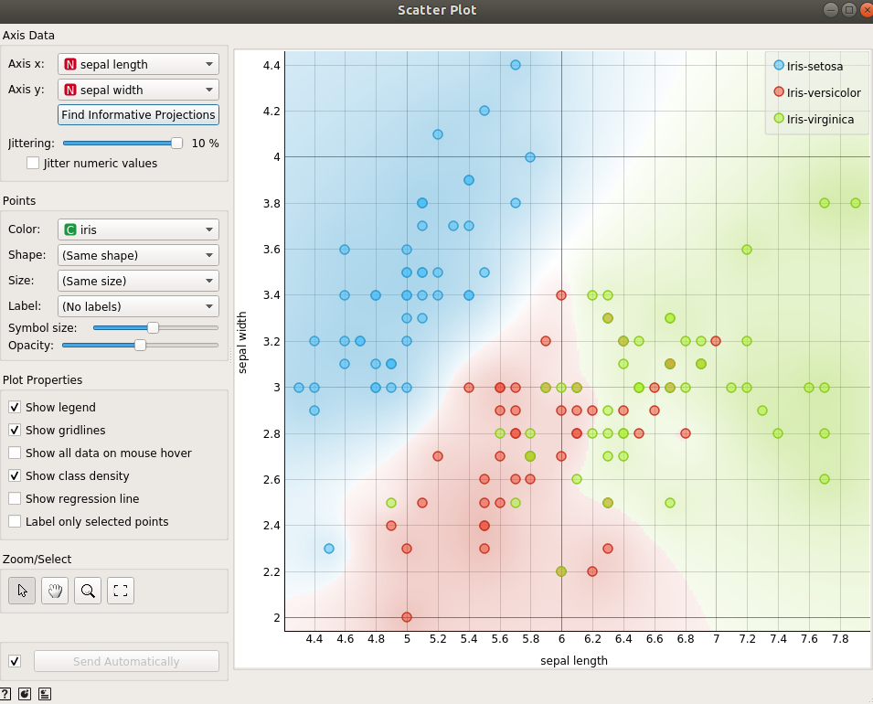
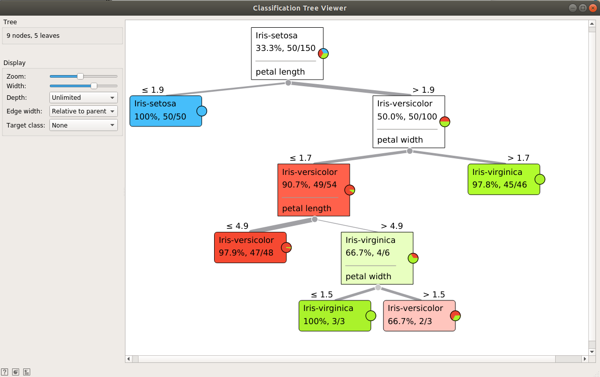
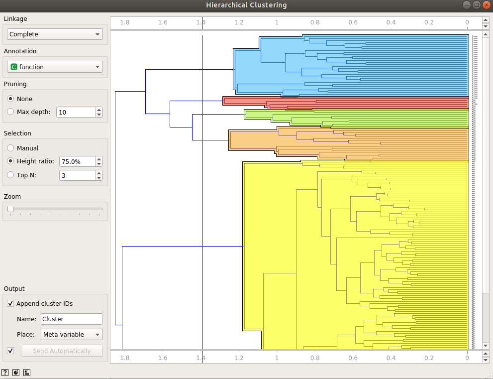

# Orange 3 for Data Mining


Orange is a Data Mining environment used for machine learning and data visualization. It offers interactive data analysis workflows with a large toolbox.
You can explore statistical distributions, box plots, scatter plots or dive deeper with decision trees, hierarchical clustering and/or heatmaps. The programming is done visually, as Orange introduces the use of data exploration through widgets that connect and load your datasets.

The following example is based on Conda 4.5.11 (Canary) and Anaconda 3.5 for Debian 9.x (Stretch). The installation also uses Python 3. It can be seen in the following command that is obtained in the `%post` section:

```
$ wget -c https://repo.continuum.io/archive/Anaconda3-5.3.0-Linux-x86_64.sh
/bin/bash Anaconda3-5.3.0-Linux-x86_64.sh -bfp /usr/local
```

To build the image using Singularity, you should run the following command:

```
$ sudo singularity build orange.sif orange.def
```

The definition file above has an `%environment` section in which all of the environment variables needed for Orange 3 are defined.

The `%post` section contains the needed dependencies and libraries for the Orange 3 installation. Global dependencies, Conda dependencies, Python 3 and Orange 3 dependencies are installed in that specific order.

To run the image and use the Orange 3 environment for Data mining, you need just to run the following command:

```
$ sudo singularity run orange.sif
```

After that, the Orange 3 environment will open, you should see a screen like this:



From there you could start loading some examples, tutorials or start analyzing your own datasets.

Here are some examples of what you can do with Orange 3:

- Use widgets and connect them using different functionalities: Classification tree, Box Plots, Scatter Plots:

  

- Use a visual representation of your data using a Scatter Plot:

  

- Identify data classes using a Classification Tree viewer:

  

- Do a Hierarchical Clustering analysis of your data:

  
